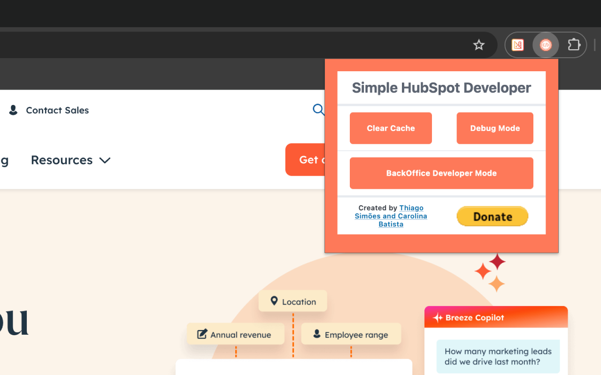

# HubSpot Developer Extension

This is an unofficial Chrome Extension designed to assist developers working with the HubSpot platform. With this extension, you can quickly access useful tools for development and debugging within the HubSpot ecosystem.

## Features

- Easy session cookie viewing
- Debugging tools for integrations
- Improved development experience

## Usage

Once installed, you can access the extension by clicking the icon in the Chrome extension bar. The tools will be available to streamline your development within HubSpot.

## Contribution

Feel free to contribute! Report bugs, submit pull requests, and suggest new features.

## Disclaimer

This extension is not an official HubSpot tool and has no affiliation with the company.

---

# Extensão para Desenvolvedores HubSpot

Esta é uma extensão não oficial do Chrome projetada para ajudar desenvolvedores que trabalham com a plataforma HubSpot. Com essa extensão, você pode acessar ferramentas úteis para desenvolvimento e depuração dentro do ecossistema HubSpot.

## Recursos

- Facilidade para visualizar cookies de sessão
- Opções para depuração de integrações
- Melhorias na experiência de desenvolvimento

## Uso

Após instalar a extensão, você poderá acessá-la clicando no ícone na barra de extensões do Chrome. As ferramentas estarão disponíveis para facilitar o desenvolvimento dentro do HubSpot.

## Contribuição

Sinta-se à vontade para contribuir com melhorias! Relate bugs, envie pull requests e sugira novos recursos.

## Aviso

Essa extensão não é uma ferramenta oficial da HubSpot e não tem qualquer relação com a empresa.